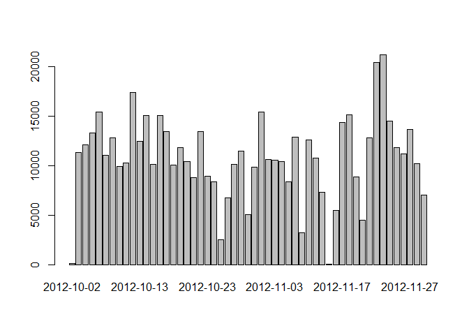
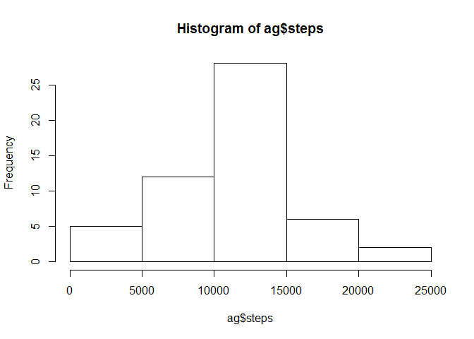
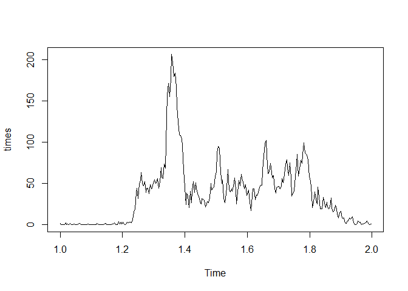
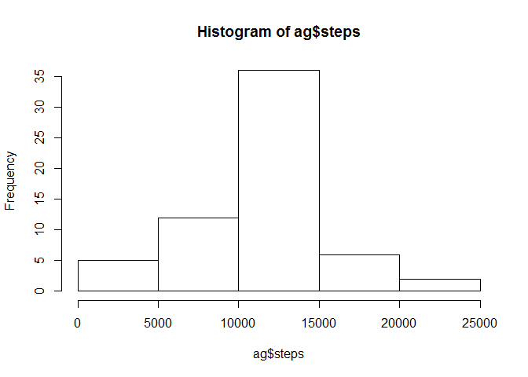
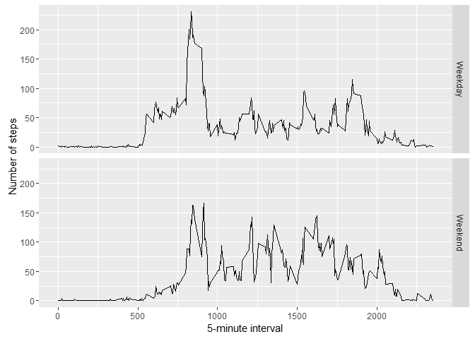

# Reproducible Research: Peer Assessment 1


## Loading and preprocessing the data
We first load the data

```r
activity = read.csv("C:/tfs/Additional/r/Reproducible Research/project/RepData_PeerAssessment1/activity/activity.csv")
#activity = activity[complete.cases(activity_base),]
library("ggplot2")
```


## What is mean total number of steps taken per day?
First we sum the data per date:

```r
ag <- aggregate(steps ~ date, data = activity, sum)
```

The we generate some charts:

```r
barplot(ag$steps, names.arg = ag$date)
```



```r
hist(ag$steps)
```



Calculate the mean and median:

```r
mean(ag$steps)
```

```
## [1] 10766.19
```

```r
median(ag$steps)
```

```
## [1] 10765
```


## What is the average daily activity pattern?
First we aggregate by interval and take the mean:

```r
ag2 = aggregate(steps ~ interval, data = activity, mean)
times = ts(ag2$steps, frequency = 288)
```

the plot:

```r
plot(times)
```



the maximum number of steps:

```r
ag2[which.max(ag2$steps),]
```

```
##     interval    steps
## 104      835 206.1698
```


## Imputing missing values
Total number of missing values:

```r
sum(is.na(activity$steps))
```

```
## [1] 2304
```

We will take the average of the interval as replacement:

```r
ag_int <- data.frame(aggregate(steps ~ interval, data = activity, mean))
```

We will merge the dataset with the averages:

```r
m = merge(activity, ag_int, all.x = T, all.y = T, by = "interval")
```

Then replace the missing values with the average:

```r
n = transform(m, steps = ifelse(is.na(steps.x), steps.y, steps.x))
```

The charts:

```r
ag <- aggregate(steps ~ date, data = n, sum)
hist(ag$steps)
```



```r
mean(ag[,"steps"], na.rm=T)
```

```
## [1] 10766.19
```

```r
median(ag[,"steps"])
```

```
## [1] 10766.19
```


## Are there differences in activity patterns between weekdays and weekends?
We first get the weekdaynumbers:

```r
n2 = cbind(n, wday = as.POSIXlt(as.Date(n$date))$wday)
```

Based on the number of the day (6 or 0) we can determine the weekends:

```r
n3 = transform(n2, DayType = ifelse(wday == 6 | wday == 0, "Weekend", "Weekday"))
```

The we aggregate by DayType:

```r
n4 = aggregate(steps ~ interval + DayType, data = n3, mean)
```

And finally generate the plot:

```r
ggplot(n4, aes(interval, steps)) + geom_line() + facet_grid(DayType ~ .) + 
    xlab("5-minute interval") + ylab("Number of steps")
```



